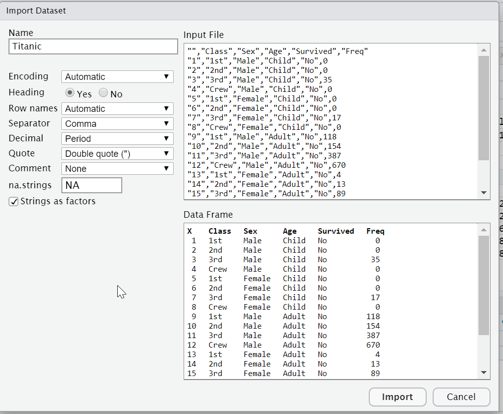
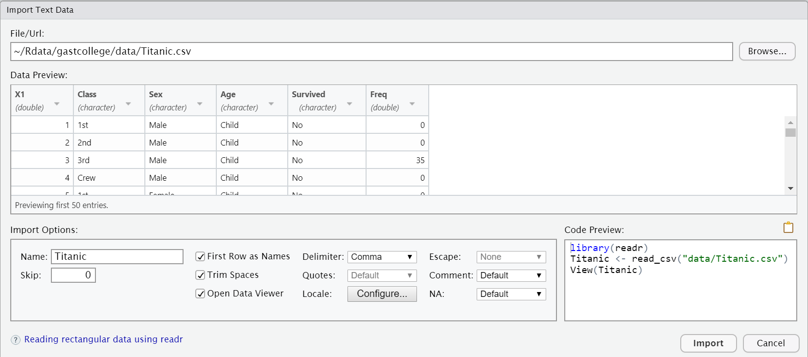
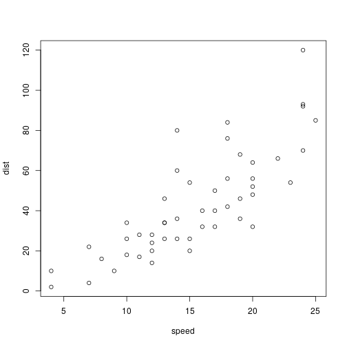

Introduction to R and RSrudio
========================================================
author: Marko Draisma
date: 17-03-2019
autosize: true

R en RStudio
========================================================
* **R** is the language, the workhorse
* **RStudio** is your gate to productivity
  - Console is a way to communicate with R directly
  - Terminal is a Linux terminal
  - To try out and remember your steps: use **R scripts**
  - To document and remember your steps: use **R notebooks**

Starting a project
=======================================================
File > New Project > 
* New Directory
* Existing Directory

Getting the data
========================================================
Using the menu: 
* Environment tab (Right) > Import Dataset > From Text (base)...

Getting the data
========================================================
Using the menu: 
* Environment tab (Right) > Import Dataset > From Text (readr)...

Getting the data
========================================================
* Using commands:

`library(readr)`  
`Titanic <- read_csv("data/Titanic.csv")`  

`Titanic <- read_csv("data/Titanic.csv", col_types = cols(`  
    `Age = col_factor(levels = c("Child", 
    "Adult")),`  
    `Class = col_factor(levels = c("1st",
    "2nd", "3rd", "Crew"), ordered=TRUE),`  
    `Sex = col_factor(levels = c("Female", 
    "Male")),`  
    `Survived = col_factor(levels = c("No", 
    "Yes"))))`
    
`View(Titanic)`

Getting the data
========================================================
class: small-code
| Function	| What It Does	| Example |
|---------|-------|-------|
|read.table()|	Reads any tabular data where the columns are separated (for example by commas or tabs). You can specify the separator (for example, commas or tabs), as well as other arguments to precisely describe your data. |	read.table(file=”myfile”, sep=”t”, header=TRUE) |
| read.csv() |	A simplified version of read.table() with all the arguments preset to read CSV files, like Microsoft Excel spreadsheets.	| read.csv(file=”myfile”) |
| read.csv2() |	A version of read.csv() configured for data with a comma as the decimal point and a semicolon as the field separator.	| read.csv2(file=”myfile”, header=TRUE) |
| read.delim() |	Useful for reading delimited files, with tabs as the default separator. |	read.delim(file=”myfile”, header=TRUE) |
| scan() |	Allows you finer control over the read process when your data
isn’t tabular.	| scan(“myfile”, skip = 1, nmax=100) |
readLines() |	Reads text from a text file one line at a time. |	readLines(“myfile”) |
| read.fwf |	Read a file with dates in fixed-width format. In other words, each column in the data has a fixed number of characters. |	read.fwf(“myfile”, widths=c(1,2,3) |

Slide With Plot
========================================================

